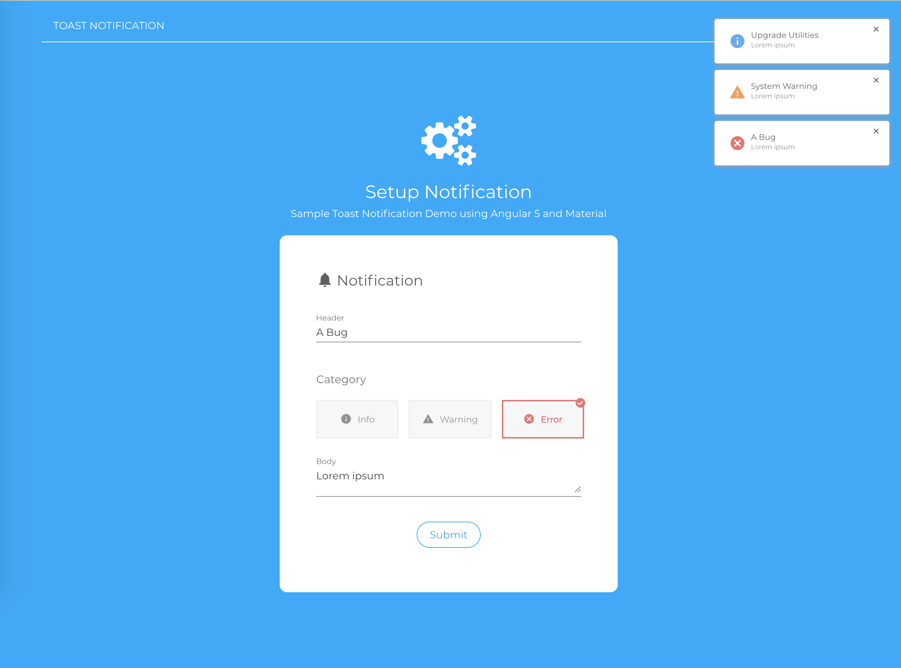

# Toast Notification

> An Angular 5 single-page-application implementing Toast Notification Module



#### Main Dev Tools used:
`Angular 5, Angular CLI, Angular Material, SCSS, Typescript, ES6, Jasmine, Karma`

#### Clone the project
` $ https://github.com/KShewengerz/toast-notification`

#### Run the Application
```
  $ npm install
  $ npm start
    
  - Runs at http://localhost: 4200
  - If running on IE, some features are only available on IE11+ 
```

#### Live App Documentation
```
    $ npm run compodoc
    $ npm run live:documentation
    
    - Runs at http://localhost:8080  
```


